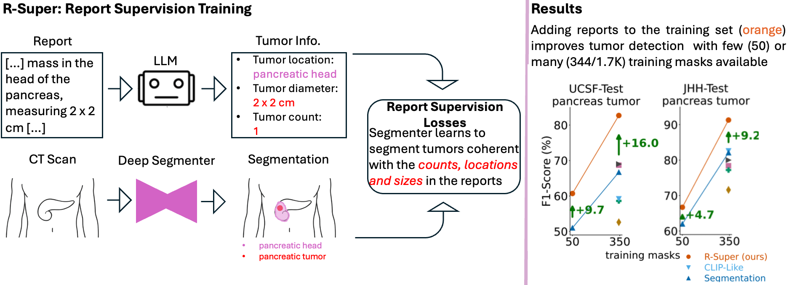

<h1 align="center">R-Super: Learning Segmentation from Radiology Reports</h1>

<div align="center">


[](https://github.com/MrGiovanni/R-Super/stargazers)
<a href="https://twitter.com/bodymaps317">
        
</a><br/>
**Subscribe us: https://groups.google.com/u/2/g/bodymaps**  

</div>

<div align="center">
 

</div>

*Abdominal CT datasets have dozens to a couple thousand tumor masks. In contrast, hospitals and new public datasets have tens/hundreds of thousands of tumor CTs with radiology reports. Thus, we ask:* **how can radiology reports improve tumor segmentation?**

We present R-Super, a training strategy that transforms radiology reports (text) into direct (per-voxel) supervision for tumor segmentation AI. Before training, we use LLM to extract tumor information from radiology reports. Then, R-Super introduces new loss functions, which use this extracted information to teach the AI to segment tumors that are coherent with reports, in terms of tumor count, diameters, and locations. By merging large-scale CT-Report datasets (e.g., [AbdomenAtlas 3.0](https://github.com/MrGiovanni/RadGPT/), [CT-Rate](https://huggingface.co/datasets/ibrahimhamamci/CT-RATE), [Merlin](https://stanfordaimi.azurewebsites.net/datasets/60b9c7ff-877b-48ce-96c3-0194c8205c40)), with small or large CT-Mask datasets (e.g., [MSD](http://medicaldecathlon.com), [AbdomenAtlas 2.0](https://github.com/MrGiovanni/RadGPT/)), the peformance of tumor segmentation AI can **improve by up to 8-16%** in F1, AUC, DSC and NSD. 


## Paper

<b>Learning Segmentation from Radiology Reports</b> <br/>
[Pedro R. A. S. Bassi](https://scholar.google.com/citations?user=NftgL6gAAAAJ&hl=en), [Wenxuan Li](https://scholar.google.com/citations?hl=en&user=tpNZM2YAAAAJ), [Jieneng Chen](https://scholar.google.com/citations?user=yLYj88sAAAAJ&hl=zh-CN), Zheren Zhu, Tianyu Lin, [Sergio Decherchi](https://scholar.google.com/citations?user=T09qQ1IAAAAJ&hl=it), [Andrea Cavalli](https://scholar.google.com/citations?user=4xTOvaMAAAAJ&hl=en), [Kang Wang](https://radiology.ucsf.edu/people/kang-wang), [Yang Yang](https://scholar.google.com/citations?hl=en&user=6XsJUBIAAAAJ), [Alan Yuille](https://www.cs.jhu.edu/~ayuille/), [Zongwei Zhou](https://www.zongweiz.com/)* <br/>
*Johns Hopkins University* <br/>
MICCAI, 2025 <br/>
<a href='https://www.cs.jhu.edu/~zongwei/publication/bassi2025learning.pdf'></a>

## Instructions

To use R-Super to train a segmentation AI with radiology reports, we use an LLM to extract tumor information from reports **(1)**; we create organ segmentation masks **(2)**; and we use the new R-Super loss functions (volume and ball losses) to train the segmentation AI with both segmentation masks and radiology reports **(3)**.

<details>
<summary style="margin-left: 25px;">How to use report supervision on your custom segmentation architecture?</summary>
<div style="margin-left: 25px;">

The core of R-Super is its new report supervision loss functions: the Ball Loss and the Volume Loss. To use R-Super with your own architecture, you have 2 options:
1) Just copy our loss functions to your own code. They are at: [rsuper_train/training/losses_foundation.py](rsuper_train/training/losses_foundation.py). The Volume Loss is the function volume_loss_basic, and the Ball Loss is the function ball_loss. To use the losses, first use LLMs to read reports and create organ masks (steps 1 and 2 below). You will also need to prepare your dataset to send these organ masks and report information to the losses (see [rsuper_train/training/dataset/dim3/dataset_abdomenatlas_UFO.py](rsuper_train/training/dataset/dim3/dataset_abdomenatlas_UFO.py)).
2) **Alternativelly, it may be easier to add your architecture to our code.** To do so, just substitute 'class MedFormer(nn.Module)' in [rsuper_train/model/dim3/medformer.py](rsuper_train/model/dim3/medformer.py) by your own architecture. Just format the output of your architecture like we do (check the function prepare_return). After substituting your architecture in our code, just run the steps below to train it with report supervision.
</details>

<details>
<summary style="margin-left: 25px;">How to develop your own report supervision loss?</summary>
<div style="margin-left: 25px;">

The core of R-Super is its new report supervision loss functions: the Ball Loss and the Volume Loss. They are at: [rsuper_train/training/losses_foundation.py](rsuper_train/training/losses_foundation.py). The Volume Loss is the function volume_loss_basic, and the Ball Loss is the function ball_loss. If you want to develop your own report supervision loss, you can begin by modifying these functions!
</details>

### Datasets

R-Super trains with both CT-Mask pairs (potentially few) and CT-Report pairs. In our paper, our experiments used CT-Mask pairs from [AbdomenAtlas 3.0](https://github.com/MrGiovanni/RadGPT/) (to be released soon), and CT-Report from a private dataset at UCSF. As public dataset alternatives, you may use CT-Mask pairs from [MSD](http://medicaldecathlon.com) Pancreas (N=191) and CT-Report pairs from [Merlin](https://stanfordaimi.azurewebsites.net/datasets/60b9c7ff-877b-48ce-96c3-0194c8205c40) (about 2K pancreatic tumor cases). You can download these datasets by clicking on their names.

### 1- Extract tumor information from radiology reports using LLM

We use Llama 3.1 (zero-shot) and radiologist-designed prompts to extract tumor information (count, diameters, locations) from free-text radiology reports. We run the LLM *only once*, and store its outputs.

[report_extraction/README.md](report_extraction/README.md)

### 2- Create organ segmentation masks

We use an [nnU-Net](https://github.com/MIC-DKFZ/nnUNet), trained for organ segmentation on  [AbdomenAtlas 3.0](https://github.com/MrGiovanni/RadGPT/), to create segmentation masks for the pancreas sub-segments (head, body and tail), kidneys, and many other organs. We provide its weights.

[organ_masks/README.md](organ_masks/README.md)

### 3- Train the tumor segmenter with masks & reports

We use our novel Volume Loss and Ball Loss to train a tumor segmentation AI using segmentation masks (few or many) and radiology reports.

[rsuper_train/README.md](organ_masks/README.md)

## Citation

If you use the code, data or methods in this repository, please cite:

```
@article{bassi2025learning,
  title={Learning Segmentation from Radiology Reports},
  author={Bassi, Pedro RAS and Li, Wenxuan and Chen, Jieneng and Zhu, Zheren and Lin, Tianyu and Decherchi, Sergio and Cavalli, Andrea and Wang, Kang and Yang, Yang and Yuille, Alan L and others},
  journal={arXiv preprint arXiv:2507.05582},
  year={2025}
}

@article{bassi2025radgpt,
  title={Radgpt: Constructing 3d image-text tumor datasets},
  author={Bassi, Pedro RAS and Yavuz, Mehmet Can and Wang, Kang and Chen, Xiaoxi and Li, Wenxuan and Decherchi, Sergio and Cavalli, Andrea and Yang, Yang and Yuille, Alan and Zhou, Zongwei},
  journal={arXiv preprint arXiv:2501.04678},
  year={2025}
}
```

## Acknowledgement

This work was supported by the Lustgarten Foundation for Pancreatic Cancer Research and the McGovern Foundation. We thank the funding of the Italian Institute of Technology. Paper content is covered by patents pending.
