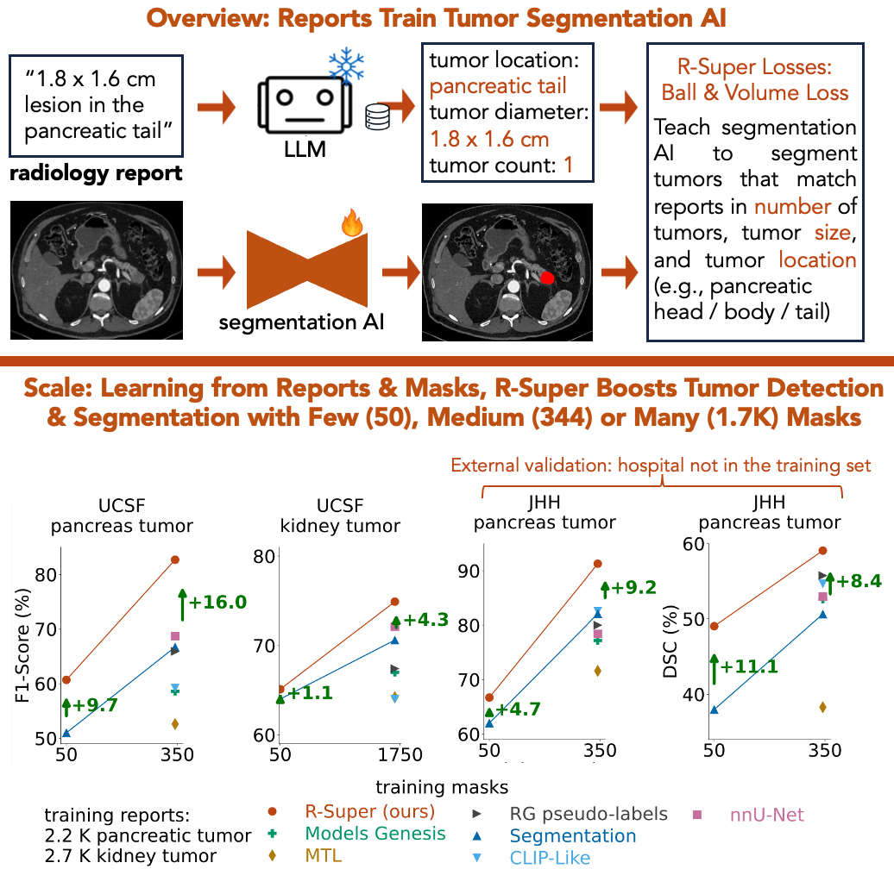

<h1 align="center">R-Super: Learning Segmentation from Radiology Reports</h1>

<div align="center">


[](https://github.com/MrGiovanni/R-Super/stargazers)
<a href="https://twitter.com/bodymaps317">
        
</a><br/>
**Subscribe us: https://groups.google.com/u/2/g/bodymaps**  

</div>


<p align="center">
  
</p> 


*Abdominal CT datasets have dozens to a couple thousand tumor masks. In contrast, hospitals and new public datasets have tens/hundreds of thousands of tumor CTs with radiology reports. Thus, we ask:* **how can radiology reports improve tumor segmentation?**

We present R-Super, a training strategy that transforms radiology reports (text) into direct (per-voxel) supervision for tumor segmentation AI. Before training, we use LLM to extract tumor information from radiology reports. Then, R-Super introduces new loss functions (Volume Loss & Ball Loss), which use this extracted information to teach the AI to segment tumors that are coherent with reports, in terms of tumor count, diameters, and locations. R-Super can train AI on large-scale CT-Report datasets (e.g., [Merlin](https://stanfordaimi.azurewebsites.net/datasets/60b9c7ff-877b-48ce-96c3-0194c8205c40)) plus small or large CT-Mask datasets (e.g., [AbdomenAtlas](https://github.com/MrGiovanni/RadGPT/), [PanTS](https://github.com/MrGiovanni/PanTS)). In comparison to traditional training with masks only, using R-Super to train with masks and reports improved the performance of tumor segmentation AI by up to **+16% in sensitivity, F1, AUC, DSC and NSD**. 


<p align="center">
  
</p> 

> [!NOTE]
> **We released Merlin Plus!**  
> The Merlin Plus dataset has 44 segmentation masks for each of the 25K CT scans in Merlin. The masks include organs, blood vessels, ducts, and organ sub-segments. Merlin Plus is a large public dataset with CT, reports, and organ masks. You can use it in the demo below to train R-Super and improve tumor segmentation.
>[Download it here!](https://huggingface.co/datasets/AbdomenAtlas/MerlinPlus/)
>
> **Extension: Learning from 100,000 CT Scans and Reports, to Segment 7 Understudied Tumor Types**  
> We have assembled more than 100,000 CT-Report pairs and trained R-Super to detect 7 tumor types missing from public CT-Mask datasets. Our preprint for this new work is available [here](https://arxiv.org/abs/2510.14803).

## Paper

<b>Scaling Artificial Intelligence for Multi-Tumor Early Detection with More Reports, Fewer Masks</b> <br/>
[Pedro R. A. S. Bassi](https://scholar.google.com/citations?user=NftgL6gAAAAJ&hl=en), [Wenxuan Li](https://scholar.google.com/citations?hl=en&user=tpNZM2YAAAAJ), [Jieneng Chen](https://scholar.google.com/citations?user=yLYj88sAAAAJ&hl=zh-CN), Zheren Zhu, Tianyu Lin, [Sergio Decherchi](https://scholar.google.com/citations?user=T09qQ1IAAAAJ&hl=it), [Andrea Cavalli](https://scholar.google.com/citations?user=4xTOvaMAAAAJ&hl=en), [Kang Wang](https://radiology.ucsf.edu/people/kang-wang), [Yang Yang](https://scholar.google.com/citations?hl=en&user=6XsJUBIAAAAJ), [Alan Yuille](https://www.cs.jhu.edu/~ayuille/), [Zongwei Zhou](https://www.zongweiz.com/)* <br/>
*Johns Hopkins University* <br/>
<a href='https://www.cs.jhu.edu/~zongwei/publication/bassi2025scaling.pdf'></a>

<b>Learning Segmentation from Radiology Reports</b> <br/>
[Pedro R. A. S. Bassi](https://scholar.google.com/citations?user=NftgL6gAAAAJ&hl=en), [Wenxuan Li](https://scholar.google.com/citations?hl=en&user=tpNZM2YAAAAJ), [Jieneng Chen](https://scholar.google.com/citations?user=yLYj88sAAAAJ&hl=zh-CN), Zheren Zhu, Tianyu Lin, [Sergio Decherchi](https://scholar.google.com/citations?user=T09qQ1IAAAAJ&hl=it), [Andrea Cavalli](https://scholar.google.com/citations?user=4xTOvaMAAAAJ&hl=en), [Kang Wang](https://radiology.ucsf.edu/people/kang-wang), [Yang Yang](https://scholar.google.com/citations?hl=en&user=6XsJUBIAAAAJ), [Alan Yuille](https://www.cs.jhu.edu/~ayuille/), [Zongwei Zhou](https://www.zongweiz.com/)* <br/>
*Johns Hopkins University* <br/>
MICCAI 2025 <br/>
<a href='https://www.cs.jhu.edu/~zongwei/publication/bassi2025learning.pdf'></a> <a href='https://www.cs.jhu.edu/~zongwei/poster/bassi2025miccai_rsuper.pdf'></a>
<a href='https://www.cs.jhu.edu/news/for-ai-tumor-detection-a-picture-isnt-always-worth-a-thousand-words/'></a>

## Awards

- RSNA 2025 Certificate of Merit Award
- ${\color{red} {\textbf{MICCAI 2025 Best Paper Award (Runner-up, top 2 in 1,027 papers)}}}$ <br/>

<p align="center">
  
</p> 


## R-Super Demo with Public Data


This demo trains and evaluates R-Super (Report Supervision) with only **public data, making it fully-reproducible.** Click here: [**R-Super Merlin Demo**](rsuper_train/Merlin_demo.md)

Datasets (check the demo for download instructions):
- **[PanTS](https://github.com/MrGiovanni/PanTS)**: 10K CT, 1.1K pancreatic lesion segmentation masks
- **[Merlin](https://stanfordaimi.azurewebsites.net/datasets/60b9c7ff-877b-48ce-96c3-0194c8205c40)**: 25K CTs & reports, 2K pancreatic lesion CTs, no mask
- **[Merlin Plus](https://huggingface.co/datasets/AbdomenAtlas/MerlinPlus/)**: 25K organ segmentation masks for Merlin, 44 classes


> **Easy to Reproduce** R-Super usually needs 3 steps: LLM extracts tumor information from reports, creation of organ segmentation masks, and training R-Super. Our demo skips steps 1 and 2. You can download the LLM output, organ segmentation masks (Merlin Plus), and just train R-Super. You can also download the trained R-Super checkpoint and test.

## Public Trained Checkpoints

For inference instructions, check the evaluation section [here](rsuper_train/README.md) (detailed) or in our [demo](rsuper_train/Merlin_demo.md) (simplified).

| Model | Training Data | Tasks | Evaluation | Access |
|-------|---------------|-------|------------|--------|
| **R-Super (Paper)** | *16K CTs*, AbdomenAtlas 2.0 (public) & UCSF (private) | Pancreas & kidney tumor segmentation | Table 2, [MICCAI paper](https://www.cs.jhu.edu/~zongwei/publication/bassi2025learning.pdf) (R-Super) | 🤗 [Download](https://huggingface.co/AbdomenAtlas/R-SuperPancreasKidney) |
| **R-Super (Demo)** | *14K CTs*, PanTS (public) & Merlin (public) | Pancreas tumor segmentation | [Demo](rsuper_train/Merlin_demo.md) | 🤗 [Download](https://huggingface.co/AbdomenAtlas/R-SuperPanTSMerlin) |
| **Baseline (Paper, no report supervision)** | *9K CTs*, AbdomenAtlas 2.0 (beta) | Pancreas & kidney tumor segmentation | Table 2, [MICCAI paper](https://www.cs.jhu.edu/~zongwei/publication/bassi2025learning.pdf) (Segmentation) | 🤗 [Download](https://huggingface.co/AbdomenAtlas/RSuperMaskPretrained) |
| **Baseline (Demo, no report supervision)** | *10K CTs*, PanTS | Pancreas tumor segmentation | [Demo](rsuper_train/Merlin_demo.md) | 🤗 [Download](https://huggingface.co/AbdomenAtlas/MedFormerPanTS) |


> The checkpoint 'R-Super (Paper)' is the public segmentation checkpoint trained with **the largest number of lesion CT scans (5K)** that we know of: *2.2K pancreatic lesion CT-Report pairs, 344 pancreatic lesion CT-Mask pairs, 2.7K kidney lesion CT-Report pairs, 1.7K kidney lesion CT-Mask pairs, 9K controls w/o kidney or pancreas tumors.*


## Detailed Code Instructions

These instructions are not needed to follow our demo (see above), but they are useful to train R-Super with your own data, or to modify R-Super. R-Super scales tumor segmentation AI by training with radiology reports, with 3 steps (*click to open each readme*):

[**1- Use LLM to extract tumor information from reports**](report_extraction/README.md)

[**2- Create organ segmentation masks**](organ_masks/README.md)

[**3- Train (and test) R-Super for tumor segmentation, using masks & reports**](rsuper_train/README.md)

### Customizations


<details>
<summary style="margin-left: 25px;">How to use report supervision on your custom segmentation architecture?</summary>
<div style="margin-left: 25px;">

The core of R-Super is its new report supervision loss functions: the Ball Loss and the Volume Loss. To use R-Super with your own architecture, you have 2 options:
1) Just copy our loss functions to your own code. They are at: [rsuper_train/training/losses_foundation.py](rsuper_train/training/losses_foundation.py). The Volume Loss is the function volume_loss_basic, and the Ball Loss is the function ball_loss. To use the losses, first use LLMs to read reports and create organ masks (steps 1 and 2 above). You will also need to prepare your dataset to send these organ masks and report information to the losses (see our dataset at [rsuper_train/training/dataset/dim3/dataset_abdomenatlas_UFO.py](rsuper_train/training/dataset/dim3/dataset_abdomenatlas_UFO.py)).
2) **Alternatively, it may be easier to add your architecture to our code.** To do so, just substitute 'class MedFormer(nn.Module)' in [rsuper_train/model/dim3/medformer.py](rsuper_train/model/dim3/medformer.py) by your own architecture. Just format the output of your architecture like we do (check the function prepare_return). After substituting your architecture in our code, just run the 3 steps above to train it with report supervision and test it.
</details>

<details>
<summary style="margin-left: 25px;">How to develop your own report supervision loss?</summary>
<div style="margin-left: 25px;">

The core of R-Super is its new report supervision loss functions: the Ball Loss and the Volume Loss. They are at: [rsuper_train/training/losses_foundation.py](rsuper_train/training/losses_foundation.py). The Volume Loss is the function volume_loss_basic, and the Ball Loss is the function ball_loss. If you want to develop your own report supervision loss, you can begin by modifying these functions!
</details>

<details>
<summary style="margin-left: 25px;">Public Datasets</summary>
<div style="margin-left: 25px;">

R-Super trains segmentation AI with both CT-Mask pairs (potentially few) and CT-Report pairs. In our paper, our experiments used CT-Mask pairs from AbdomenAtlas 2.0 Beta, and CT-Report from a private dataset from UCSF. In our public demo, we replaced the private report dataset with the public Merlin Dataset, from Stanford, and AbdomenAtlas 2.0 by PanTS, from Johns Hopkins University, the largest dataset with pancreatic tumor masks. Both results are remarkably strong: **UCSF reports improved pancreatic tumor detection F1-Score by 16%, Merlin reports improved it by 10%.** 

PS: Merlin was not public at the time we wrote the MICCAI paper.

</details>


## Novel loss functions: reports supervise segmentation

#### Volume Loss
<div align="center">
  
</div>

#### Ball Loss
<div align="center">
  
</div>


## Citation

If you use the code, data or methods in this repository, please cite:

```
@inproceedings{bassi2025learning,
  title={Learning Segmentation from Radiology Reports},
  author={Bassi, Pedro RAS and Li, Wenxuan and Chen, Jieneng and Zhu, Zheren and Lin, Tianyu and Decherchi, Sergio and Cavalli, Andrea and Wang, Kang and Yang, Yang and Yuille, Alan L and others},
  booktitle={International Conference on Medical Image Computing and Computer-Assisted Intervention},
  pages={305--315},
  year={2025},
  organization={Springer}
}

@article{bassi2025scaling,
  title={Scaling Artificial Intelligence for Multi-Tumor Early Detection with More Reports, Fewer Masks},
  author={Bassi, Pedro RAS and Zhou, Xinze and Li, Wenxuan and P{\l}otka, Szymon and Chen, Jieneng and Chen, Qi and Zhu, Zheren and Prz{\k{a}}do, Jakub and Hamac{\i}, Ibrahim E and Er, Sezgin and others},
  journal={arXiv preprint arXiv:2510.14803},
  year={2025}
}

@article{bassi2025radgpt,
  title={Radgpt: Constructing 3d image-text tumor datasets},
  author={Bassi, Pedro RAS and Yavuz, Mehmet Can and Wang, Kang and Chen, Xiaoxi and Li, Wenxuan and Decherchi, Sergio and Cavalli, Andrea and Yang, Yang and Yuille, Alan and Zhou, Zongwei},
  journal={arXiv preprint arXiv:2501.04678},
  year={2025}
}
```

## Acknowledgement

This work was supported by the Lustgarten Foundation for Pancreatic Cancer Research and the McGovern Foundation. We thank the funding of the Italian Institute of Technology. Paper content is covered by patents pending.
