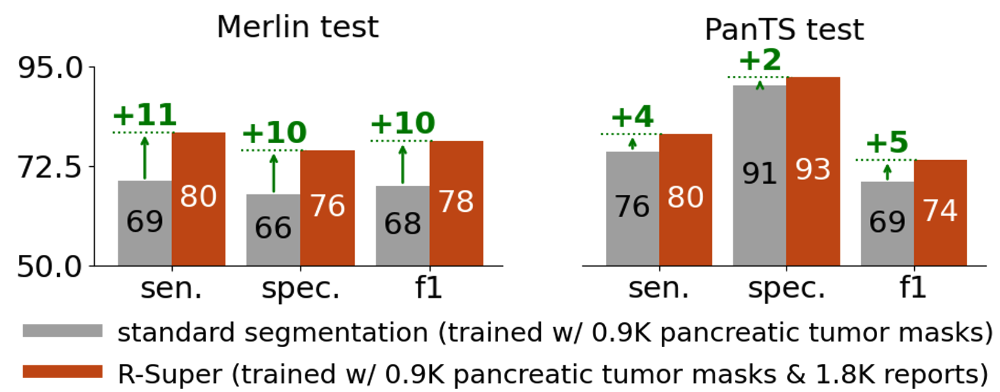

<div align="center">
  
</div>

# R-Super Demo With Public Data

This demo uses only **public data, making it fully-reproducible.** We train a pancreatic lesion segmentation AI, using two public datasets: [PanTS](https://github.com/MrGiovanni/PanTS) (1.1K pancreatic lesion per-voxel segmentation masks) and [Merlin](https://stanfordaimi.azurewebsites.net/datasets/60b9c7ff-877b-48ce-96c3-0194c8205c40) (2048 pancreatic lesion reports, no mask). We randomly split Merlin into training (3.6K CTs) and testing datasets (400 CTs). For PanTS, we use its official train/test split. Expected test results are in the figure below. We evaluate 2 AI models: R-Super (orange), trained with both PanTS masks and the Merlin reports; and a standard segmentation AI, trained with masks only. R-Super yields large improvements in F1-Score in both test datasets.



The demo below trains R-Super with 0.9K pancreatic lesion masks (PanTS training set) & 1,851 pancreatic lesion reports (Merlin). Then, it evaluates R-Super.

> **Skip to Evaluation.**
> You can download the final, fully-trained R-Super checkpoint [here](https://huggingface.co/AbdomenAtlas/R-SuperPanTSMerlin), and the baseline model (no report supervision) [here](https://huggingface.co/AbdomenAtlas/MedFormerPanTS). Then, you can just do the Installation, Downloads, and Evaluation steps below (no training).

## Installation

<details>
<summary style="margin-left: 25px;">[Optional] Install Anaconda on Linux</summary>
<div style="margin-left: 25px;">
    
```bash
wget https://repo.anaconda.com/archive/Anaconda3-2024.06-1-Linux-x86_64.sh
bash Anaconda3-2024.06-1-Linux-x86_64.sh -b -p ./anaconda3
./anaconda3/bin/conda init
source ~/.bashrc
```
</div>
</details>

Create a new virtual environment and install all dependencies.
```bash
cd R-Super/rsuper_train
conda create -n rsuper python=3.10
conda activate rsuper
pip install -r requirements.txt
```

## Downloads

Download data and pre-trained models:
- **PanTS** CT scans and per-voxel masks: [PanTS 🤗](https://github.com/MrGiovanni/PanTS).
- **AI model pre-trained on PanTS** (trained w/ mask only): [AbdomenAtlas/RSuperMaskPretrained 🤗](https://huggingface.co/AbdomenAtlas/MedFormerPanTS). Move the downloaded model to 'R-Super/rsuper_train/exp/abdomenatlas/MedFormerPanTS/'.
- **Merlin**, CT scans: [Merlin official website (Stanford)](https://stanfordaimi.azurewebsites.net/datasets/60b9c7ff-877b-48ce-96c3-0194c8205c40)
- **Merlin Plus** organ segmentation masks: We have created segmentation masks for 44 organs in the whole Merlin dataset. In collaboration with the authors of Merlin (Stanford). Download them here: [Merlin Plus 🤗](https://huggingface.co/datasets/AbdomenAtlas/MerlinPlus/).

<details>
<summary style="margin-left: 25px;">Merlin Download Details</summary>
<div style="margin-left: 25px;">
We cannot redistribute Merlin CTs, but it is easy to download. Click on the 'Merlin official website' link above, create an account and request access to Merlin.
You will get access immediately. Then, click on the link above again. In the page that will open, click "Download  (2970.90 GB)" in the top left corner. This will not download the dataset, but you will get another link, something like https://aimistanforddatasets01****&sp=rl. Copy and paste it in the command below. Run the command to download Merlin.

```bash
env -u http_proxy -u https_proxy -u HTTP_PROXY -u HTTPS_PROXY \
    HTTPS_PROXY=dummy.invalid NO_PROXY="*" \
    azcopy copy "paste_your_link_here"      "/path/to/Merlin/download/destination/" --rec--recursive
```

</div>
</details>


### Renaming datasets
> **Change paths beginning with '/path/to/'** in all commands below to the real paths in your computer; --src_path id the Merlin data you downloaded, --label_path the path to its organ segmentation masks, and tgt_path is an arbitrary save destination (command output).

```bash
python dataset_conversion/rename_pants.py /path/to/data/you/downloaded/PanTS/ImagesTr/

python dataset_conversion/rename_to_BDMAP.py --input_folder /path/to/data/you/downloaded/merlin_data/ --mapping dataset_conversion/mapping_merlin.csv

python dataset_conversion/rename_to_BDMAP.py --input_folder /path/to/data/you/downloaded/merlin_per_voxel_masks/ --mapping dataset_conversion/mapping_merlin.csv --masks

python dataset_conversion/abdomenatlas_3d.py \
    --src_path /path/to/data/you/downloaded/merlin_data/ \
    --label_path /path/to/data/you/downloaded/merlin_per_voxel_masks/ \
    --tgt_path /path/to/merlin_medformer_pancreas_normals/ --workers 16 \
    --ids Merlin_pancreas_all_cases.csv \
    --label_yaml dataset_conversion/label_names_report_dataset_pancreas.yaml
```


<details>
<summary style="margin-left: 25px;">Details and Disk Space</summary>
<div style="margin-left: 25px;">
The command above converts all pancreatic lesion cases in Merlin (~2K) plus ~2K normals to the BDMAP_ID format (like AbdomenAtlas), and saves it in tgt_path. If you need to reduce disk usage, you can delete Merlin (src_path) after this step. 
</div>
</details>

> **Skip to Evaluation.**
> The steps below are not needed if you are not going to train R-Super. In this case, skip from here to Evaluation.

## Convert datasets from nifti to npz

Merlin:
```bash

python dataset_conversion/rename_to_BDMAP.py --input_folder /path/to/data/you/downloaded/merlin_per_voxel_masks/ --mapping dataset_conversion/mapping_merlin.csv --masks

python dataset_conversion/abdomenatlas_3d.py \
    --src_path /path/to/data/you/downloaded/merlin_data/ \
    --label_path /path/to/data/you/downloaded/merlin_per_voxel_masks/ \
    --tgt_path /path/to/merlin_medformer_pancreas_normals/ --workers 16 \
    --ids Merlin_pancreas_all_cases.csv \
    --label_yaml dataset_conversion/label_names_report_dataset_pancreas.yaml

python nii2npz.py \
    --src_path /path/to/merlin_medformer_pancreas_normals/ \
    --tgt_path /path/to/merlin_medformer_pancreas_normals_npz/
```

PanTS:
```bash
python dataset_conversion/abdomenatlas_3d.py \
    --src_path /path/to/data/you/downloaded/PanTS/ImagesTr/ \
    --label_path /path/to/data/you/downloaded/PanTS/ImagesTr/ \
    --tgt_path /path/to/pants_medformer/ --workers 16 \
    --label_yaml dataset_conversion/label_names_mask_dataset_pancreas.yaml

python nii2npz.py \
    --src_path /path/to/pants_medformer/ \
    --tgt_path /path/to/pants_medformer_npz/
```


##  Data augmentation

The function below is a continuous loop that must be **kept running during the entire training procedure**. You can stop it with 'pkill -f rsuper'

```bash
python AugmentEternal.py --dataset atlas_ufo --model medformer --dimension 3d --batch_size 2 \
--crop_on_tumor --workers_overwrite 4 \
--save_destination /path/to/Merlin_and_PanTS_Agumented/ \
--dataset_path /path/to/data/you/downloaded/PanTS/ImagesTr/ \
--UFO_root /path/to/merlin_medformer_pancreas_normals_npz/ \
--ucsf_ids Merlin_pancreas_training_cases.csv \
--reports Merlin_per_tumor_metadata_hf_clean.csv \
--tumor_classes pancreas &
```

<details>
<summary style="margin-left: 25px;">GPU Memory Usage</summary>
<div style="margin-left: 25px;">
Our AI uses >30GB of GPU memory. To reduce it to ~20GB, add --crop_size 96 to the code above (default crop_size is 128)
</div>
</details>

## Train R-Super with reports (1.8 K) and masks (0.8 K)

```bash
python train_ddp.py --dataset abdomenatlas_ufo --model medformer --dimension 3d --batch_size 4 --unique_name merlin_pancreas \
    --crop_on_tumor --gpu '0,1' --workers 4 --classes_number 42 --load_augmented \
    --pretrain --pretrained './exp/abdomenatlas/MedFormerPanTS/fold_0_latest.pth' \
    --loss ball_dice_last --dist_url tcp://127.0.0.1:9697 --report_volume_loss_basic 0.1 \
    --save_destination /path/to/Merlin_and_PanTS_Agumented/ \
    --data_root /path/to/data/you/downloaded/PanTS/ImagesTr/ \
    --UFO_root /path/to/merlin_medformer_pancreas_normals_npz/ \
    --ucsf_ids Merlin_pancreas_training_cases.csv \
    --reports Merlin_per_tumor_metadata_hf_clean.csv \
    --tumor_classes pancreas \
    --epochs 100 --lr 0.0001 \
    #--resume --load './exp/abdomenatlas_ufo/merlin_pancreas/fold_0_latest.pth'
```

<details>
<summary style="margin-left: 25px;">GPU Number, Memory Usage and Resume Training</summary>
<div style="margin-left: 25px;">

- crop_size: our AI uses >30GB of GPU memory. To reduce it to ~20GB, add --crop_size 96 to the code above (default crop_size is 128), and substitute the pretrained model by a small one (to be released): "--pretrained './exp/abdomenatlas/MedFormerPanTS/fold_0_latest.pth'" becomes "--pretrained './exp/abdomenatlas/MedFormerPanTS_crop96/fold_0_latest.pth'" 
- resume training: if you want to resume training from a previous run, uncomment the last line in the command above 
- gpu: The command above trains on 2 gpus. To train on 1 gpu, set --gpu '0' and --batch_size 2. To train on 4 GPUs: --gpu '0,1,2,3' --batch_size 8. Batch size is total, not per-gpu. We recoment batch size >= 2*(number of GPUs). --gpu takes the indices of the GPUs that you want to use.
</div>
</details>

## Evaluation

### Save the output segmentation masks


Save binary tumor and organ segmentation masks created by R-Super. Add --save_probabilities_lesions to save probabilities for tumors (slower, heavier disk usage).
```bash
python predict_abdomenatlas.py \
    --load "./exp/abdomenatlas_ufo/merlin_pancreas/fold_0_latest.pth" \
    --img_path "/path/to/merlin_medformer_pancreas_normals/" \
    --class_list dataset_conversion/label_names_mask_dataset_pancreas.yaml \
    --gpu '0' --organ_mask_on_lesion \
    --save_path "./result/test_on_merlin/" \
    --ids  Merlin_pancreas_testing_cases.csv \
    --meta Merlin_metadata_hf_clean.csv \
    --reports Merlin_per_tumor_metadata_hf_clean.csv
```

### Calculate Sensitivity, Specificity and F1-Score

```bash
python test_with_reports.py \
  --outputs_folder "./result/test_on_merlin/abdomenatlas/merlin_pancreas/" \
  --ct_folder "/path/to/merlin_medformer_pancreas_normals/" \
  --workers 20 --continuing

python calculate_sensitivity_specificity.py \
  --predictions_csv "./result/test_on_merlin/abdomenatlas/merlin_pancreas/tumor_detection_results.csv" \
  --ground_truth_csv Merlin_metadata_hf_clean.csv \
  --output_csv "./result/test_on_merlin/abdomenatlas/merlin_pancreas/metrics.csv"
```

Find the final results in result/test_on_merlin/abdomenatlas/merlin_pancreas/metrics.csv. The file includes sensitivity, specificity and F1-Score at multiple decision thresholds.

<details>
<summary style="margin-left: 25px;">Decision thresholds and AUC</summary>
<div style="margin-left: 25px;">

For speed, we only saved binary tumor segmentation masks. To calculate sensitivity, specificity and F1-Score, we threshold the volume of the predicted tumor. Only if the predicted tumor is larger than the threshold, we consider that the patient has a tumor. The file metrics.csv shows performance at multiple volume thresholds. Instead of using volume thresholds, you can save tumor probabilities in predict_abdomenatlas.py (add --save_probabilities_lesions), and later use eval_AUC.py, followed by calculate_sensitivity_specificity_F1_AUC.py to calculate AUC, sensitivity, specificity and F1-Score at multiple **confidence** (and volume, optionally) thresholds.
</div>
</details>

<details>
<summary style="margin-left: 25px;">Evaluate the baseline model</summary>
<div style="margin-left: 25px;">

All our evaluation code is set to evaluate R-Super. To evaluate the baseline model (trained with segmentation masks only, no reports), follow the procedure below (we just changed merlin_pancreas -> MedFormerPanTS):

```bash
python predict_abdomenatlas.py \
    --load "./exp/abdomenatlas_ufo/MedFormerPanTS/fold_0_latest.pth" \
    --img_path "/path/to/merlin_medformer_pancreas_normals/" \
    --class_list dataset_conversion/label_names_mask_dataset_pancreas.yaml \
    --gpu '0' --organ_mask_on_lesion \
    --save_path "./result/test_on_merlin/" \
    --ids  Merlin_pancreas_testing_cases.csv

python test_with_reports.py \
  --outputs_folder "./result/test_on_merlin/abdomenatlas/MedFormerPanTS/" \
  --ct_folder "/path/to/merlin_medformer_pancreas_normals/" \
  --workers 20 --continuing

python calculate_sensitivity_specificity.py \
  --predictions_csv "./result/test_on_merlin/abdomenatlas/MedFormerPanTS/tumor_detection_results.csv" \
  --ground_truth_csv Merlin_metadata_hf_clean.csv \
  --output_csv "./result/test_on_merlin/abdomenatlas/MedFormerPanTS/metrics.csv"
```

</div>
</details>


<details>
<summary style="margin-left: 25px;">Evaluate on the PanTS test set</summary>
<div style="margin-left: 25px;">

```bash
python predict_abdomenatlas.py \
    --load "./exp/abdomenatlas_ufo/merlin_pancreas/fold_0_latest.pth" \
    --img_path /path/to/data/you/downloaded/PanTS/ImagesTe/
    --class_list dataset_conversion/label_names_mask_dataset_pancreas.yaml \
    --gpu '0' --organ_mask_on_lesion \
    --save_path "./result/test_on_pants/" \
    --ids  pants_test_set.csv

python test_with_reports.py \
  --outputs_folder "./result/test_on_pants/abdomenatlas/merlin_pancreas/" \
  --ct_folder /path/to/data/you/downloaded/PanTS/ImagesTe/ \
  --workers 20 --continuing

python calculate_sensitivity_specificity.py \
  --predictions_csv "./result/test_on_pants/abdomenatlas/merlin_pancreas/tumor_detection_results.csv" \
  --ground_truth_csv metadata_pants.csv \
  --output_csv "./result/test_on_pants/abdomenatlas/merlin_pancreas/metrics.csv"
```

</div>
</details>
